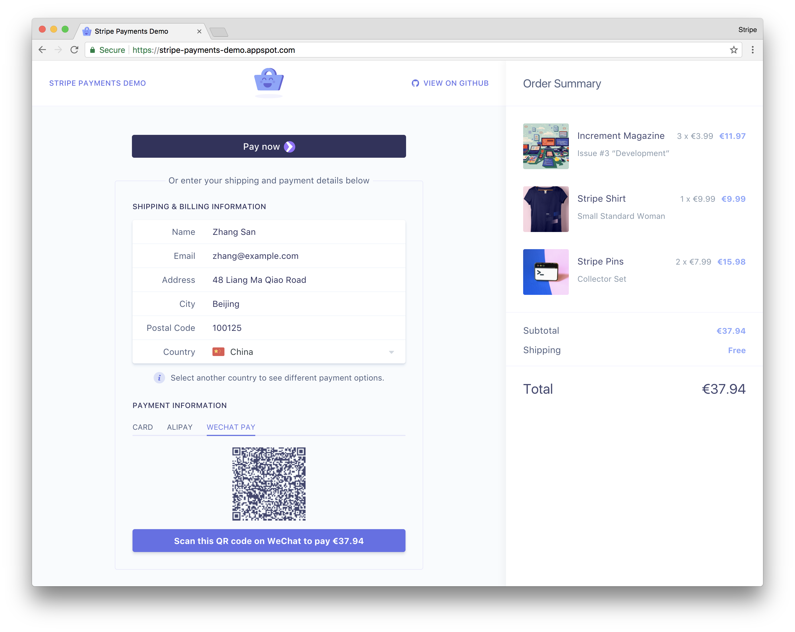
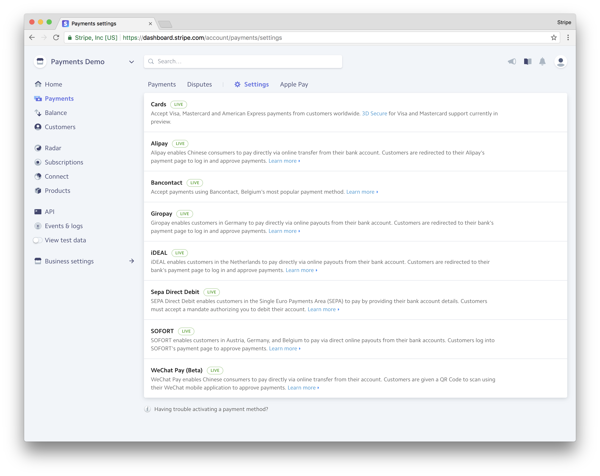

# Stripe Payments Demo

This demo features a sample e-commerce store that uses [Stripe Elements](https://stripe.com/docs/elements) and the [Sources API](https://stripe.com/docs/sources) to illustrate how to accept both card payments and additional payment methods on the web.

If you’re running a compatible browser, this demo also showcases the [Payment Request API](https://stripe.com/docs/payment-request-api), [Apple Pay](https://stripe.com/docs/apple-pay), and [Pay with Google](https://stripe.com/docs/pay-with-google) for a seamless payment experience.

You can see this demo app running in test mode on [stripe-payments-demo.appspot.com](https://stripe-payments-demo.appspot.com).

## Overview

This demo provides an all-in-one example for integrating with Stripe on the web:

<!-- prettier-ignore -->
|     | Features
:---: | :---
✨ | **Beautiful UI components for card payments**. This demo uses pre-built Stripe components customized to fit the app design, including the [Card Element](https://stripe.com/docs/elements) which provides real-time validation, formatting, and autofill.
💳 | **Card payments with Payment Request, Apple Pay, and Pay with Google.** The app offers frictionless card payment experiences with a single integration using the new [Payment Request Button Element](https://stripe.com/docs/elements/payment-request-button).
🌍 | **Payment methods for Europe and Asia.** A dozen redirect-based payment methods are supported through the [Sources API](https://stripe.com/docs/sources), from iDEAL to WeChat Pay.
🎩 | **Automatic payment methods suggestion.** Picking a country will automatically show relevant payment methods. For example, selecting  “Germany” will suggest SOFORT, Giropay, and SEPA Debit.
🔐 | **Dynamic 3D Secure for Visa and Mastercard.** The app automatically handles the correct flow to complete card payments with [3D Secure](https://stripe.com/docs/sources/three-d-secure), whether it’s required by the card or by the app above a certain amount.
📲 | **QR code generation for WeChat Pay.** During the payment process for [WeChat Pay](https://stripe.com/payments/payment-methods-guide#wechat-pay), a QR code is generated for the WeChat Pay URL to authorize the payment in the WeChat app.
🚀 | **Built-in proxy for local HTTPS and webhooks.** Card payments require HTTPS and asynchronous payment methods with redirects rely on webhooks to complete transactions—[ngrok](https://ngrok.com/) is integrated so the app is served locally over HTTPS and an endpoint is publicly exposed for webhooks.
🔧 | **Webhook signing and idempotency keys**. We verify webhook signatures and pass idempotency keys to charge creations, two recommended practices for asynchronous payment flows.
📱 | **Responsive design**. The checkout experience works on all screen sizes. Apple Pay works on Safari for iPhone and iPad if the Wallet is enabled, and Payment Request works on Chrome for Android.
📦 | **No datastore required.** Products, SKUs, and Orders are stored using the [Stripe Orders API](https://stripe.com/docs/orders), which you can replace with your own database to keep track of orders and inventory.

## Payments Integration

The core logic of the Stripe integration is mostly contained within two files:

1. [`public/javascripts/payments.js`](public/javascripts/payments.js) creates the payment experience on the frontend using Stripe Elements.
2. [`server/routes.js`](server/routes.js) defines the routes on the backend that create Stripe charges and receive webhook events.

### Card Payments with Stripe Elements

[Stripe Elements](https://stripe.com/docs/elements) let you quickly support cards, Apple Pay, Pay with Google, and the new Payment Request API.

Stripe Elements are rich, pre-built UI components that create optimized checkout flows across desktop and mobile. Elements can accept any CSS property to perfectly match the look-and-feel of your app. They simplify the time-consuming parts when building payment forms, e.g. input validation, formatting, localization, and cross-browser support.

This demo uses both the [Card Element](https://stripe.com/docs/elements) and the [Payment Request Button](https://stripe.com/docs/elements/payment-request-button), which provides a single integration for Apple Pay, Pay with Google, and the Payment Request API—a new browser standard that allows your customers to quickly provide payment and address information they’ve stored with their browser.

### Beyond Cards: Payments Sources for Europe and Asia

This demo also shows how to reach customers in Europe and Asia by supporting their preferred way to pay online. It supports payment methods such as [Alipay](https://stripe.com/payments/payment-methods-guide#alipay), [Bancontact](https://stripe.com/payments/payment-methods-guide#bancontact), [iDEAL](https://stripe.com/payments/payment-methods-guide#ideal), [Giropay](https://stripe.com/payments/payment-methods-guide#giropay), [SEPA Direct Debit](https://stripe.com/payments/payment-methods-guide#sepa), [SOFORT](https://stripe.com/payments/payment-methods-guide#sofort), and [WeChat Pay](https://stripe.com/payments/payment-methods-guide#wechat).

The [Sources API](https://stripe.com/docs/sources) provides a single integration for all these payment methods. You can support new payment methods without changing a line of code, simply by activating it them in the [Payments Settings](https://dashboard.stripe.com/account/payments/settings) of your Stripe Dashboard.

## Requirements

You’ll need the following:

* [Node.js](http://nodejs.org) >= 7.x.
* Modern browser that supports ES6 (Chrome to see the Payment Request, and Safari to see Apple Pay).
* Stripe account to accept payments ([sign up](https://dashboard.stripe.com/register) for free).

In your Stripe Dashboard, you can [enable the payment methods](https://dashboard.stripe.com/payments/settings) you’d like to test with one click.

Some payment methods require receiving a real-time webhook notification to complete a charge. This demo is bundled with [ngrok](https://ngrok.com/), which allows us to securely receive webhooks and serve the app locally via HTTPS, which is also required to complete transactions in the browser with Elements or the Payment Request API.

## Getting Started

Copy the configuration file:

    cp config.example.js config.js

Update `config.js` with your own [Stripe API keys](https://dashboard.stripe.com/account/apikeys) and any other configuration details.

Install dependencies using npm:

    npm install

Next, we’ll create a few default products and SKUs for your Stripe account. Run the `setup` script once:

    npm run setup

This demo uses the Stripe API as a datastore for products and orders, but you can always choose to use your own datastore instead.

Run the app:

    npm run start

Two public ngrok URLs will be provided when the app starts. The first URL should be used to [setup webhooks](https://dashboard.stripe.com/account/webhooks) in your Stripe Dashboard. For example:

    https://<example>.ngrok.io/webhook

The second URL will serve our app via HTTPS. For example:

    https://<example>.ngrok.io

Use this second URL in your browser to start the demo.

**Don’t want to use ngrok?** As long as you serve the app over HTTPS and that Stripe can reach the webhook endpoint via a public URL, all the payment flows will work.

## Credits

* Code: [Romain Huet](https://twitter.com/romainhuet) and [Thorsten Schaeff](https://twitter.com/schaeff_t)
* Design: [Tatiana Van Campenhout](https://twitter.com/tatsvc)
